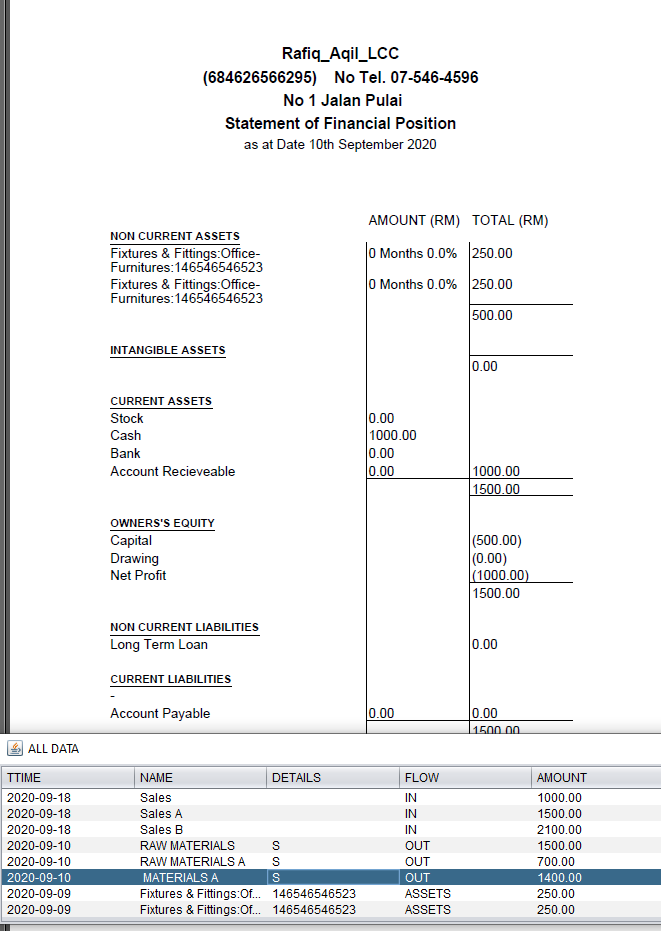
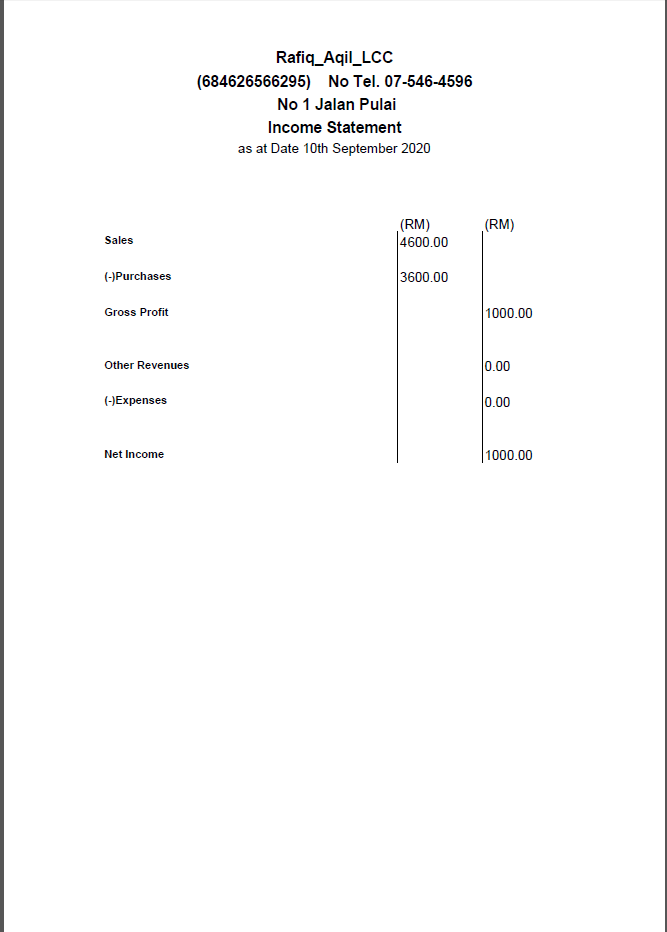
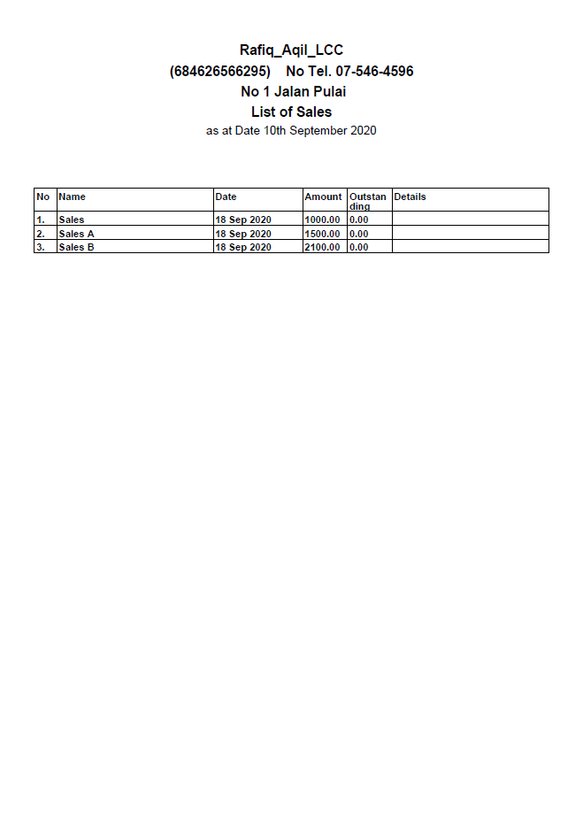
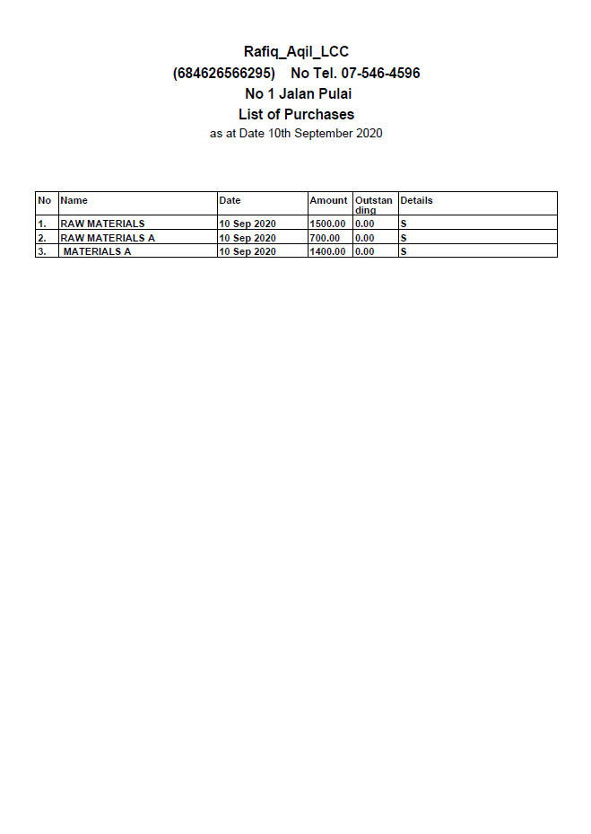

# Mini-Accounting-System-NATIVE-JAVA

This app is made using language native java front-end and local sql backend. Stand-Alone executeable launcher is available for try.  The app recieved entries by user and will automatically produce the PDF Ballance Sheet, Cash Flow, Statement of Financial Position using the sotred data. CRUD Data is all operated using JAVA Frontend User Interface.  

# Screenshots of the Windows java app

# Screenshots of the PDF generated by the System

